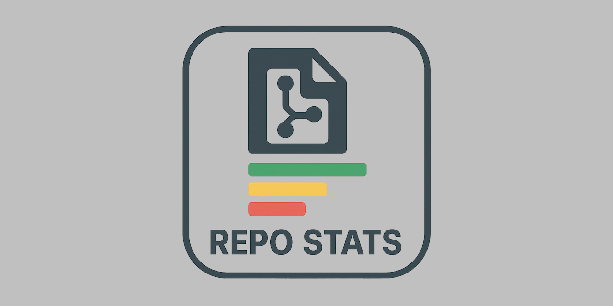

### 📊 GitHub Repository Stats

**Complete GitHub repository analytics with releases, downloads & comprehensive visual insights**

## 🌟 Overview

**GitHub Repository Stats** is a powerful, browser-based analytics tool that provides comprehensive statistics and insights for any public GitHub repository. Built with vanilla JavaScript and Chart.js, it delivers real-time data visualization without requiring any backend infrastructure or API keys.

This tool goes beyond basic repository information to provide deep insights into repository health, popularity, release management, and download analytics - all through an elegant, responsive interface.

## 📸 Screenshot


*GitHub Repository Stats displaying comprehensive analytics for a repository*

## ✨ Key Features

### 📈 **Comprehensive Statistics**
- **Core Metrics**: Stars, forks, watchers, open issues
- **Activity Data**: Contributors, commits, branches, pull requests
- **Network Stats**: Subscribers, network size
- **Repository Info**: Size, creation date, last update, last push

### 🚀 **Release Management**
- **Complete Release Tracking**: View all repository releases with detailed information
- **Download Analytics**: 
  - Total downloads across all releases
  - Per-release download statistics
  - Average downloads per release
  - Individual asset download counts
- **Release Details**: 
  - Release notes and descriptions
  - Asset information with file sizes
  - Pre-release and draft indicators
  - Publication dates and authors
- **Interactive Release Browser**: Dropdown selector for easy navigation

### 📊 **Visual Analytics**
- **Language Distribution Chart**: Doughnut chart showing codebase composition
- **Downloads by Release**: Bar chart of top 10 releases by download count
- **Release Timeline**: Line chart showing cumulative release history

### 🔍 **Smart Repository Discovery**
- **Flexible Input Formats**:
  - Full repository path: `owner/repo` (e.g., `microsoft/typescript`)
  - Owner-only search: `owner` (e.g., `microsoft`)
- **Repository Browser**: When searching by owner, displays all public repositories with:
  - Star counts
  - Repository descriptions
  - Easy selection dropdown

### ⚡ **Performance & Efficiency**
- **Intelligent Caching**: 5-minute cache duration to reduce API calls
- **Rate Limit Management**: 
  - Real-time rate limit monitoring
  - Visual warnings when approaching limits
  - Countdown timer to rate limit reset
- **Optimized API Usage**: Minimizes redundant requests

### 🎨 **User Experience**
- **Modern UI Design**: Clean, gradient-based interface with smooth animations
- **Responsive Layout**: Fully functional on desktop, tablet, and mobile devices
- **Interactive Elements**: 
  - Expandable release cards
  - Hover effects and transitions
  - Loading indicators
- **Cache Indicators**: Visual feedback when using cached data
- **Quick Actions**: "Refresh" and "Analyze Another" buttons for easy navigation

### 🔒 **Repository Information**
- **Detailed Metadata**:
  - Repository description and homepage
  - Primary programming language
  - License information
  - Default branch name
  - Topics/tags
- **Feature Flags**: 
  - Wiki status
  - GitHub Pages status
  - Projects enabled/disabled
  - Discussions enabled/disabled
- **Status Indicators**: Archived repository warnings

## 🚀 Usage

### Basic Usage

1. **Open the Application**
   - Open `src/repo-stats.html` in any modern web browser

2. **Search for a Repository**
   
   **Option A: Direct Repository Access**
   ```
   Enter: owner/repo
   Example: microsoft/typescript
   ```
   
   **Option B: Browse Owner's Repositories**
   ```
   Enter: owner
   Example: microsoft
   ```
   Then select a repository from the dropdown list

3. **View Analytics**
   - Scroll through comprehensive statistics
   - Explore interactive charts
   - Review release information and download statistics

4. **Refresh Data**
   - Click the "🔄 Refresh" button to bypass cache and fetch latest data

5. **Analyze Another Repository**
   - Click "🔍 Analyze Another" button or modify the search input

### Input Format Examples

| Input Format | Example | Description |
|--------------|---------|-------------|
| `owner/repo` | `facebook/react` | Direct repository access |
| `owner` | `google` | Browse all owner's repositories |
| Full URL* | `https://github.com/nodejs/node` | Legacy support (auto-parsed) |

*Note: Full GitHub URLs are automatically parsed to owner/repo format

## 🛠️ Technical Details

### Technologies Used

- **Frontend**: Pure HTML5, CSS3, JavaScript (ES6+)
- **Charts**: Chart.js v4.4.0 (CDN)
- **API**: GitHub REST API v3
- **Storage**: LocalStorage for caching

### API Integration

#### GitHub REST API Endpoints Used:
- `/repos/{owner}/{repo}` - Repository information
- `/repos/{owner}/{repo}/languages` - Language statistics
- `/repos/{owner}/{repo}/contributors` - Contributor count
- `/repos/{owner}/{repo}/releases` - Release data
- `/repos/{owner}/{repo}/branches` - Branch information
- `/repos/{owner}/{repo}/pulls` - Pull request count
- `/repos/{owner}/{repo}/commits` - Commit history
- `/users/{owner}/repos` - User repositories
- `/orgs/{owner}/repos` - Organization repositories
- `/rate_limit` - API rate limit status

#### Rate Limiting
- **Limit**: 60 requests per hour (unauthenticated)
- **Monitoring**: Real-time display of remaining requests
- **Warning System**: 
  - Orange warning at <20 requests remaining
  - Red warning at <10 requests remaining
- **Reset Timer**: Countdown to rate limit reset

#### Caching Strategy
- **Duration**: 5 minutes per repository
- **Storage**: Browser LocalStorage
- **Auto-cleanup**: Removes cache older than 1 hour
- **Visual Indicator**: Shows "💾 Cached" badge when using cached data

### Browser Compatibility

| Browser | Minimum Version | Status |
|---------|----------------|--------|
| Chrome | 90+ | ✅ Fully Supported |
| Firefox | 88+ | ✅ Fully Supported |
| Safari | 14+ | ✅ Fully Supported |
| Edge | 90+ | ✅ Fully Supported |
| Opera | 76+ | ✅ Fully Supported |

**Requirements**:
- JavaScript enabled
- LocalStorage enabled
- Canvas support (for charts)

## 📦 Installation & Deployment

### Local Usage

1. **Clone or Download**
   ```bash
   git clone https://github.com/tinyBigGAMES/repo-stats.git
   cd repo-stats/repo
   ```

2. **Open in Browser**
   ```bash
   # Simply open the HTML file
   open src/repo-stats.html
   # or
   start src/repo-stats.html
   ```

### Web Hosting

#### Static Hosting (Recommended)
Deploy to any static hosting service:

- **GitHub Pages**
  ```bash
  # Push to gh-pages branch
  git subtree push --prefix repo/src origin gh-pages
  ```

- **Netlify / Vercel**
  - Drag and drop the `src` folder
  - Set build directory to `/`
  - No build command required

- **Traditional Web Server**
  - Upload `src/repo-stats.html` to web root
  - Ensure `.ico` file is in same directory
  - No server-side configuration needed

#### CDN Requirements
- Chart.js is loaded from jsDelivr CDN
- Ensure CDN access is not blocked by firewall/proxy

## 📁 Project Structure

```
repo-stats/
├── repo/
│   ├── src/
│   │   ├── repo-stats.html    # Main application file (standalone)
│   │   └── repo-stats.ico     # Favicon
│   └── README.md              # This file
```

### Single-File Architecture
The application is intentionally designed as a **single HTML file** containing:
- Complete HTML structure
- Embedded CSS styles
- Full JavaScript functionality
- No external dependencies (except Chart.js CDN)

**Benefits**:
- ✅ Easy deployment
- ✅ No build process required
- ✅ Portable and self-contained
- ✅ Works offline (after first load with cached Chart.js)

## 🎯 Features in Detail

### Statistics Cards
Each metric is displayed in an interactive card with:
- **Icon**: Visual representation
- **Value**: Formatted number (K/M notation)
- **Label**: Metric description
- **Hover Effect**: Smooth animation and shadow

### Release Management
- **Release Selector**: Dropdown with download counts
- **Summary Cards**: Total, average, and highest downloads
- **Detailed View**: 
  - Release title and version tag
  - Pre-release/draft badges
  - Publication date and author
  - Full release notes (with truncation for long notes)
  - Asset list with individual download counts
  - File sizes for each asset

### Chart Visualizations

#### Language Distribution (Doughnut Chart)
- Shows top 8 languages by byte count
- Percentage breakdown
- Color-coded segments
- Interactive tooltips

#### Downloads by Release (Horizontal Bar Chart)
- Top 10 releases by download count
- Formatted download numbers
- Color-coded bars
- Hover tooltips with exact counts

#### Release Timeline (Line Chart)
- Chronological release history
- Cumulative release count
- Date labels
- Interactive data points

## 🔐 Privacy & Security

### Data Handling
- **No Data Collection**: This tool collects no user data
- **No Analytics**: No tracking or analytics code
- **Client-Side Only**: All processing happens in the browser
- **No Authentication Required**: Uses GitHub's public API

### API Security
- **Read-Only Access**: Only reads public repository data
- **No Write Operations**: Cannot modify repositories
- **Rate Limited**: GitHub's standard rate limits apply
- **Public Data Only**: Only works with public repositories

## 🐛 Known Limitations

1. **Public Repositories Only**: Cannot access private repositories
2. **Rate Limiting**: Limited to 60 API calls per hour (unauthenticated)
3. **Large Organizations**: Repositories are limited to first 100 (sorted by stars)
4. **Release Notes**: Very long release notes are truncated (first 500 characters)
5. **Asset Types**: All assets are treated equally (no type-specific handling)

## 🚧 Troubleshooting

### Common Issues

#### "Repository not found"
- ✅ Verify the repository is public
- ✅ Check spelling of owner/repo names
- ✅ Ensure repository exists and is not deleted

#### "Rate limit exceeded"
- ✅ Wait for rate limit reset (timer shown in UI)
- ✅ Use cached data when available
- ✅ Consider authenticating with GitHub API for higher limits

#### Charts not displaying
- ✅ Ensure JavaScript is enabled
- ✅ Check browser console for errors
- ✅ Verify Chart.js CDN is accessible
- ✅ Clear browser cache and reload

#### Cached data showing
- ✅ Click "🔄 Refresh" button to bypass cache
- ✅ Cache automatically expires after 5 minutes
- ✅ Clear browser LocalStorage to force refresh

## 🤝 Contributing

Contributions are welcome! Here's how you can help:

### Areas for Contribution
- 🐛 Bug fixes
- ✨ New features
- 📝 Documentation improvements
- 🎨 UI/UX enhancements
- 🌍 Translations

### Development Guidelines
1. Maintain single-file architecture
2. Use vanilla JavaScript (no frameworks)
3. Keep dependencies minimal (Chart.js only)
4. Follow existing code style
5. Test across multiple browsers
6. Update README for new features

### Submitting Changes
1. Fork the repository
2. Create a feature branch
3. Make your changes
4. Test thoroughly
5. Submit a pull request

## 📜 License

repo-stats is licensed under the [BSD-3-Clause License](https://github.com/tinyBigGAMES/repo-stats?tab=BSD-3-Clause-1-ov-file#BSD-3-Clause-1-ov-file).

### Why BSD-3-Clause?

The BSD-3-Clause license is a permissive open-source license that provides you with:

- ✅ **Commercial Use** - Use repo-stats in commercial projects without restrictions
- ✅ **Modification** - Modify the source code to fit your needs
- ✅ **Distribution** - Redistribute the software freely
- ✅ **Private Use** - Use repo-status in private/proprietary projects
- ✅ **No Copyleft** - No requirement to open-source your projects built with repo-stats

This means you can use repo-stats to build both open-source and proprietary applications without worrying about licensing conflicts. The only requirements are to include the copyright notice and disclaimer in distributions.

## 🙏 Credits

### Developed By
**tinyBigGAMES™ LLC**
- 🌐 Website: [https://tinybiggames.com](https://tinybiggames.com)
- 💻 GitHub: [https://github.com/tinyBigGAMES](https://github.com/tinyBigGAMES)

### Technologies & Libraries
- **Chart.js**: MIT License - [Chart.js](https://www.chartjs.org/)
- **GitHub API**: REST API v3 - [GitHub Docs](https://docs.github.com/en/rest)

## 📞 Support

### Getting Help
- 📖 **Documentation**: Read this README thoroughly
- 🐛 **Bug Reports**: Open an issue on [GitHub](https://github.com/tinyBigGAMES/repo-stats/issues)
- 💡 **Feature Requests**: Submit via [GitHub issues](https://github.com/tinyBigGAMES/repo-stats/issues)
- 📧 **Contact**: Visit [tinyBigGAMES.com](https://tinybiggames.com)

### Useful Links
- [GitHub API Documentation](https://docs.github.com/en/rest)
- [Chart.js Documentation](https://www.chartjs.org/docs/)
- [tinyBigGAMES Projects](https://github.com/tinyBigGAMES)

## 🔮 Roadmap

### Planned Features
- [ ] Authentication support for higher rate limits
- [ ] Export statistics to PDF/CSV
- [ ] Comparison mode (compare multiple repositories)
- [ ] Historical data tracking
- [ ] Custom theme support
- [ ] Configurable chart types
- [ ] More detailed contributor analytics
- [ ] Issue and PR analytics
- [ ] Code frequency analysis
- [ ] Organization-wide statistics

### Future Enhancements
- Dark mode toggle
- Keyboard shortcuts
- Bookmark/favorites system
- Share links for specific repositories
- Embeddable widgets
- API response caching improvements

## 📊 Statistics

This project itself is a testament to the value of GitHub analytics:
- **Single File**: Entire application in one HTML file
- **Zero Dependencies**: Except Chart.js (CDN)
- **Pure JavaScript**: No frameworks or build tools
- **Responsive Design**: Works on all devices
- **Fast Loading**: Minimal external resources

<div align="center">

**Made with ❤️ by tinyBigGAMES™ LLC**

⭐ **Star this repository if you find it useful!** ⭐

[🌐 Website](https://tinybiggames.com) • [💻 GitHub](https://github.com/tinyBigGAMES)

</div>
